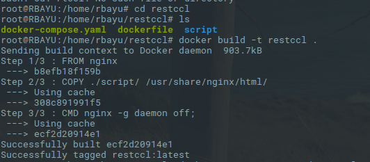
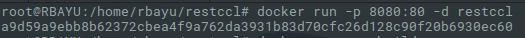
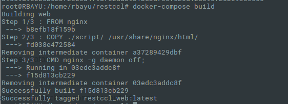
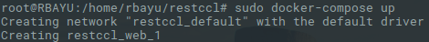
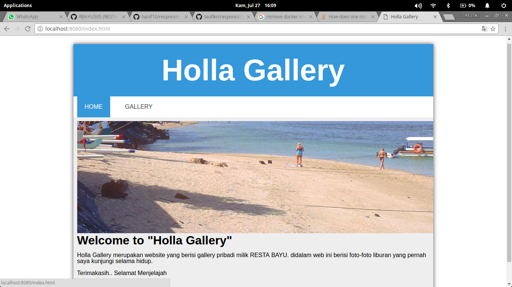
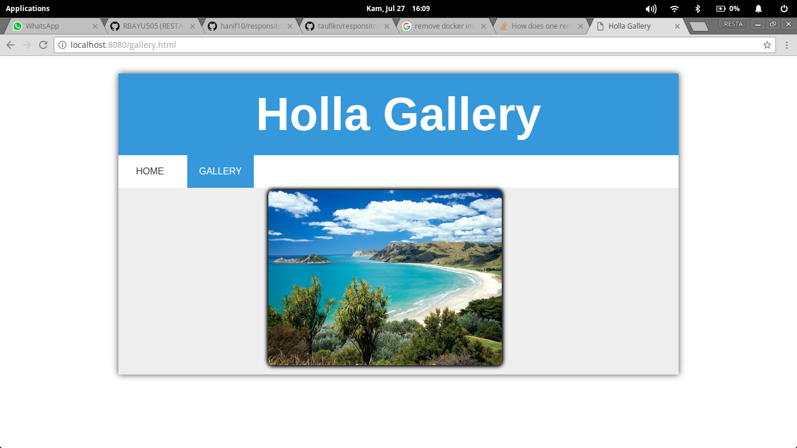
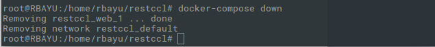

# RESPONSI TEKNOLOGI CLOUD COMPUTING LANJUT
> NAMA : RESTA BAYU SETIAWAN <br>
> NIM  : 145410161

## Membuat Web Static yang dijalankan menggunakan docker

### Dockerfile
Dockerfile merupakan script yang yang berisi dari serangkaian perintah yang akan dieksekusi secara otomatis dan berurutan untuk membuat sebuah image. Berikut adalah script yang ada dalam Dockerfile :

```
FROM nginx

COPY ./script/ /usr/share/nginx/html/
CMD ["nginx","-g","daemon off;"]

```
##### Keterangan:

1. Images yang digunakan adalah nginx web service.
2. RUN digunakan untuk menjalankan apa yang akan dilakukan pembaruan pada sistem.
3. COPY digunakan untuk memindahkan direktori *script* ke dalam docker.
</br>

### Docker Compose
docker-compose adalah alat untuk menentukan dan menjalankan aplikasi Docker multi-container.
```
version: '2'

services:
  web:
    build: .
    ports:
      - "8080:80"
    volumes:
      - ./script:/var/www/html/
    networks:
      - default
```

### Proses Dockerizing

> docker build -t restccl . 
</br>
<p align="center"><br></p>


> docker run -p 8080:80 -d restccl
</br>
<p align="center"><br></p>


> docker-compose build 
</br>
<p align="center"><br></p>


> docker-compose up
</br>
<p align="center"><br></p>

Setelah berhasil menjalankan `docker compose`, kemudian akses http://localhost:8080/ pada web browser, maka akan muncul halaman web seperti dibawah ini:
<p align="center"><br></p>
<p align="center"><br></p>

### Mematikan service pada docker
> docker-compose down
</br>
<p align="center"><br></p>


